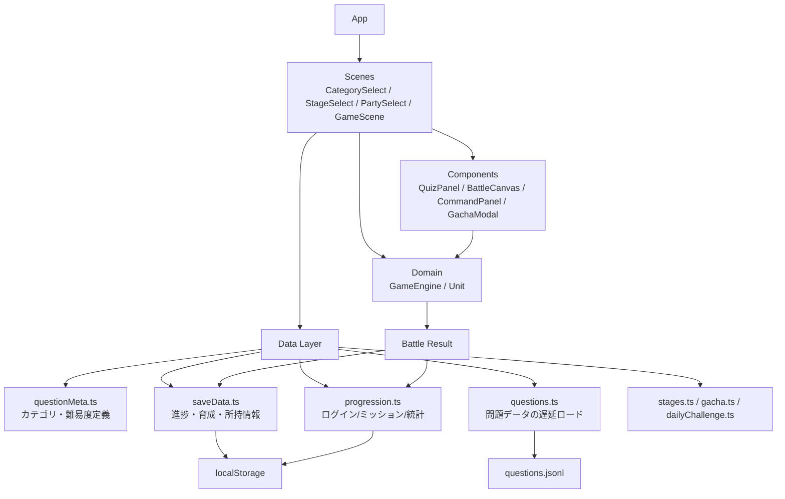

# Learning TD

クイズとタワーディフェンスを組み合わせた、ブラウザ向けの学習ゲームです。  
問題に正解してエネルギーをため、ユニットを出撃させてステージを攻略します。

カテゴリ選択、ステージ攻略、ガチャ、育成、図鑑、デイリー/ウィークリーミッションまで一通りを 1 つの Web アプリとして遊べます。

## 特徴

- クイズ正解で戦況が有利になる学習 x バトル体験
- ステージごとに背景テーマが切り替わるタワーディフェンス
- ガチャ、育成、図鑑による収集と継続プレイ要素
- カテゴリ別の得意不得意や日別学習量の可視化
- GitHub Pages でそのまま公開できる軽量なフロントエンド構成

## アーキテクチャ



### 補足

- 画面遷移の起点は [App.tsx](D:/game/tower/learning-td/src/App.tsx) です。
- 問題メタ情報は [questionMeta.ts](D:/game/tower/learning-td/src/data/questionMeta.ts) に分離されています。
- 問題本文は [questions.ts](D:/game/tower/learning-td/src/data/questions.ts) から動的 import され、初期バンドルを圧迫しない構成です。
- バトルロジックは [GameEngine.ts](D:/game/tower/learning-td/src/domain/GameEngine.ts) に集約されています。

## 遊び方

1. カテゴリと難易度を選びます
2. ステージを選んでバトルを開始します
3. クイズに正解してエネルギーをためます
4. エネルギーを使ってユニットを出撃させます
5. 敵拠点を破壊できればクリアです

## 主な機能

- 学習カテゴリ選択
  - 算数、国語、理科、社会、英語、プログラミング、雑学、なぞなぞ
- クイズバトル
  - 正解でエネルギー増加、不正解でペナルティ
  - コンボによるボーナス
- ステージ進行
  - 複数ワールド、テーマ別背景、星評価
- ガチャと育成
  - 新規ユニット獲得
  - HP / ATK 強化
  - 図鑑、熟練度、所持率表示
- 学習ダッシュボード
  - カテゴリ別正答率
  - 直近 7 日の学習量グラフ
  - デイリー / ウィークリーミッション

## 技術スタック

- React
- TypeScript
- Vite

## 開発コマンド

```bash
npm install
npm run dev
```

```bash
npm run build
```

```bash
npm run preview
```

```bash
npm run quiz:validate
```

## ディレクトリ概要

```text
src/
  components/   UI コンポーネント
  data/         問題、ステージ、進捗、保存処理
  domain/       バトルロジック、ユニット定義
  scenes/       画面単位の実装
  hooks/        画面サイズなどの補助 hooks
```

## Issue 運用

このリポジトリでは、バグ、改善案、問題品質の課題を GitHub Issue で管理します。

- 不具合: `bug`
- 機能追加: `feature`
- 問題品質: `question-quality`
- バランス調整: `balance`
- UI/UX 改善: `ux`

テンプレートは [.github/ISSUE_TEMPLATE](D:/game/tower/learning-td/.github/ISSUE_TEMPLATE) にあります。  
実装時はコミットや PR に `Closes #番号` を含めて、Issue と紐付けて進めます。

## デプロイ

- `main` への push をトリガーに GitHub Pages へ deploy
- 問題データ更新時は `npm run quiz:validate` の実行を推奨
- 画面や構成の変更後は `npm run build` で確認
